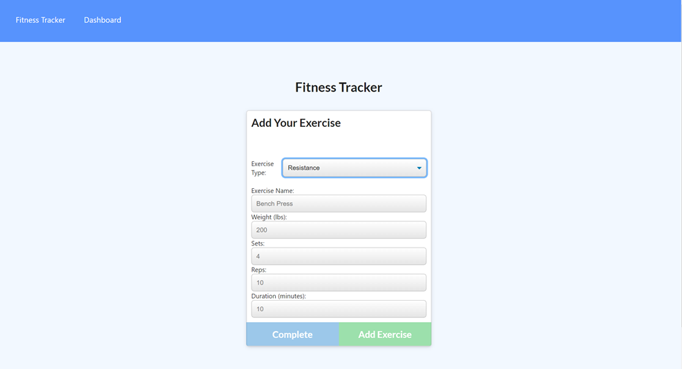
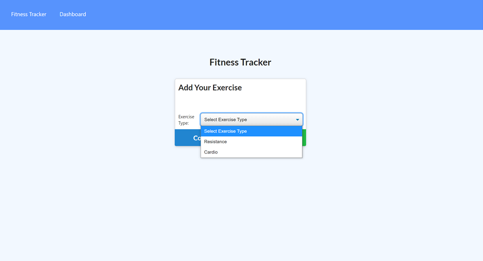
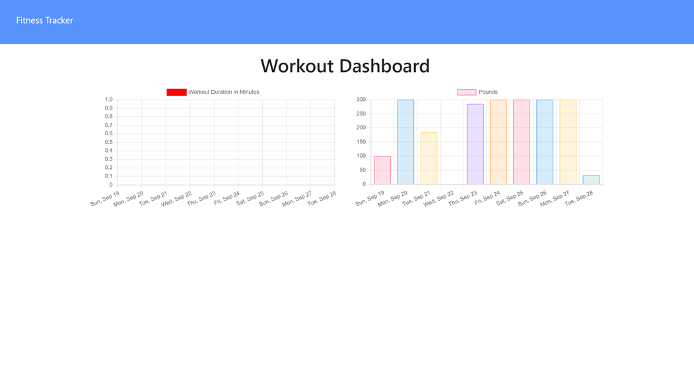
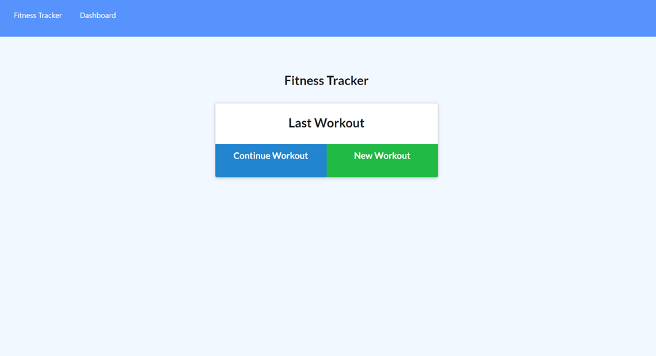

# Workout Tracker

## Discription 

With this application the user is able to view, create and track daily workouts. User can add new workout or add to an existing workout, choose workout type from resistance or cardio, fill out exercise details and add it to ongoing workout or mark it complete and view the progress over time on the dashboard and current stats on the homepage.

## Table of Content 

[Discription]()

[Deployed-Link]()

[UserStory]()

[Installing]()

[Usage]()

[Technologies]()

[Questions]()

[Acknowledgments]()

## Deployed-Link

https://fiteness-tracker.herokuapp.com/

## User Story
As a user, I want to be able to view create and track daily workouts. 

I want to be able to log multiple exercises in a workout on a given day.

I should also be able to track the name, type, weight, sets, reps, and duration of exercise. 

If the exercise is a cardio exercise, I should be able to track my distance traveled.

## Installation

Clone this repo to your local computer amd run npm install to install dependencies. At alst run node server.js to start the application.

## Usage

## Technology

MongoDB 

Mongoose 

Express.js 

Node.js

## Questions

GitHub: [github.com/kelebetengida]()

Email: [engidk@uw.edu]()

## Acknowledgments

Thankkyou to my instractors who have helped me through the learning curve of this project. 
